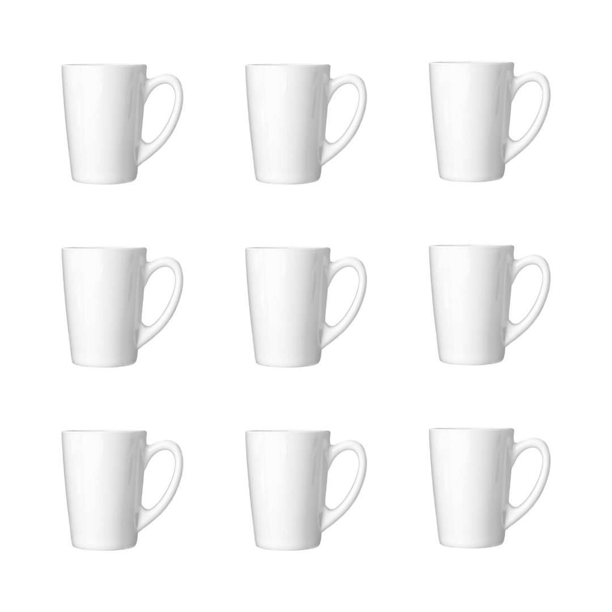
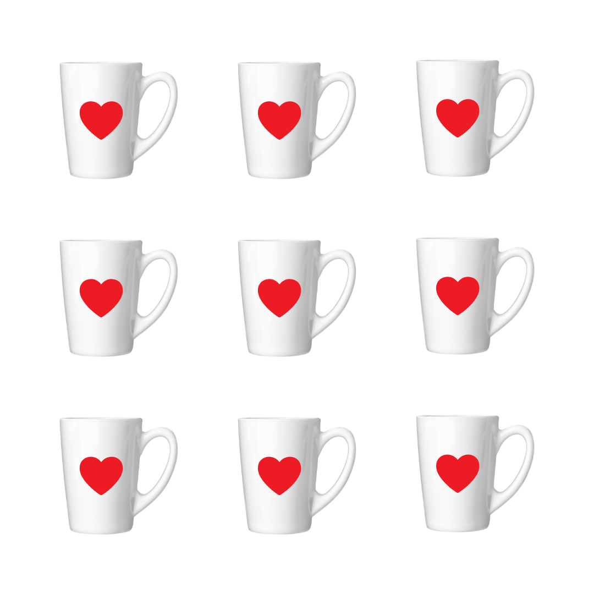
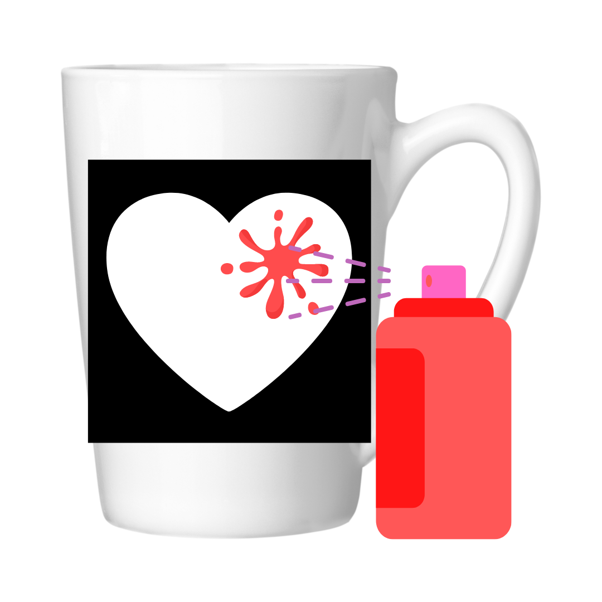
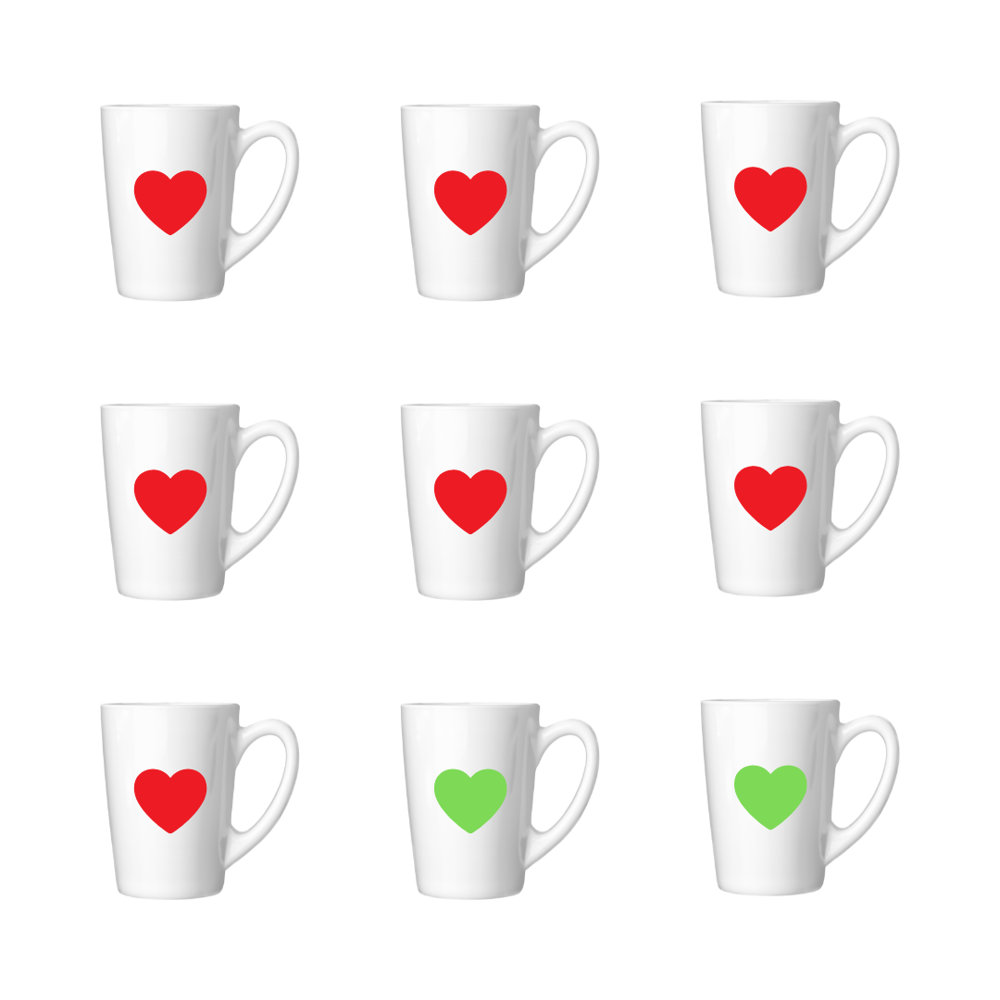

# Design Patterns

Los patrones de diseño son soluciones habituales a problemas comunes en el diseño de software. Cada patrón es como un plano que se puede personalizar para resolver un problema de diseño particular de tu código.

Si no entendiste no te preocupes, es complicado de entender sobre todo al principio. _A mi también me paso_

**Te lo voy a explicar con una analogía para que lo entiendas mejor:**

Imagina que tienes 9 tazas.

Ahora tienes que pintar la misma figura en cada taza.

Puedes pintarla a mano, una a una. Las desventajas que tenemos son:

1. Tomara más tiempo.
2. Se gastara más recursos.
3. Pueden ocurrir errores.

Una posible solución es crear una plantilla y repicarla exactamente en cada una de las tazas, esa plantilla es el patrón.

Ahora sera mucho más fácil, rápido, y barato.

Con el mismo patrón puedes cambiar ciertos _parámetros_. Por ejemplo, el color de la pintura y obtener un resultado diferente utilizando el mismo patrón. Supongamos que se cambia el color de las dos ultimas taza a verde.

"La mayoría de los patrones se describe con mucha formalidad para que la gente pueda reproducirlos en muchos contextos." ~ (2014-2021 Refactoring.Guru) _Eso fue exactamente lo que hicimos con la taza_

<!-- ## Tabla de contenidos -->
